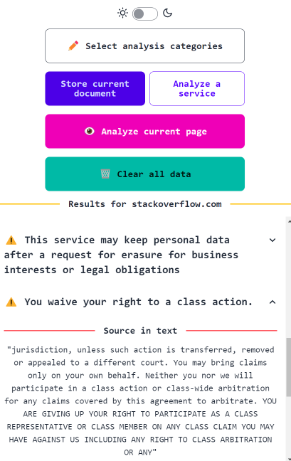

# tosleuth
A cross-platform LLM-powered browser extension that uses [Firefunction-v2](https://fireworks.ai/blog/firefunction-v2-launch-post) to automatically analyze website ToS agreements / privacy policies and present them in an easily understandable manner, based off of [ToS;DR](https://tosdr.org/en/frontpage). 

## Quick usage guide
1. Make sure the backend with the vector database is running
2. Go to a website you want to analyze
3. Use the "Store current document" button to add the current page to the vector DB (privacy policy, cookie policy, terms of service agreement, Digital Services Act, etc.)
4. Choose the categories that the LLM will use to analyze the documents (legal rights, data storage and retention policies, tracking and data collection, account policies, etc.)
5. Select the target platform from the "Analyze a service" menu

### Set up and run backend server
1. Install Docker from [this link](https://www.docker.com/products/docker-desktop/)
2. Open a terminal and do `git clone https://github.com/mad-cat-lon/tosleuth`
3. `cd tosleuth`
4. Go to [Fireworks.ai](https://fireworks.ai/) and obtain an API key
5. Put `FIREWORKS_API_KEY = YOUR_API_KEY` and put it in `.env` under `/core/`
6. `docker compose build` to build the server image
7. `docker compose up` to start the server, CTRL+C to stop the running server
8. If you have made changes and want to see them in the running server, do `docker compose up --build`
9. To stop the container run `docker compose down`

Alternatively, you can try the following at your own risk:

1. `cd core`
2. `pip install -r requirements.txt`
3. `uvicorn server:app`

### Set up and build extension frontend
1. `cd extension`
2. `npm install`
3. Build instructions:
    - For Firefox Manifest v2, do `npm run build:firefox`
    - For Chrome Manifest v3, do `npm run build:chrome`

## Running the Chrome extension
1. Go to `chrome://extensions/`
2. Click "Load unpacked"
3. Navigate to the build folder (under `/extension/build`)
4. Select the folder
You should see the side panel open and the extension loaded

## Running the Firefox extension 
1. Go to `about:debugging#/runtime/this-firefox`
2. Click "Load temporary addon"
3. Navigate to the extension build folder (under `/extension/build`)
4. Click `manifest.json`
The extension should be loaded until the browser is restarted

# Goals
- [x] ~Move to Manifest v3~
- [x] ~Cross-platform compatibility~
- [] Auto-analysis mode, where the extension will automatically find and scrape all relevant documents when the user visits a site
- [] Improved configurability and UX (let users set API key, etc. from UI)
- [] Make UI less cluttered 
- [] Simplify architecture (run vectorDB in extension itself)